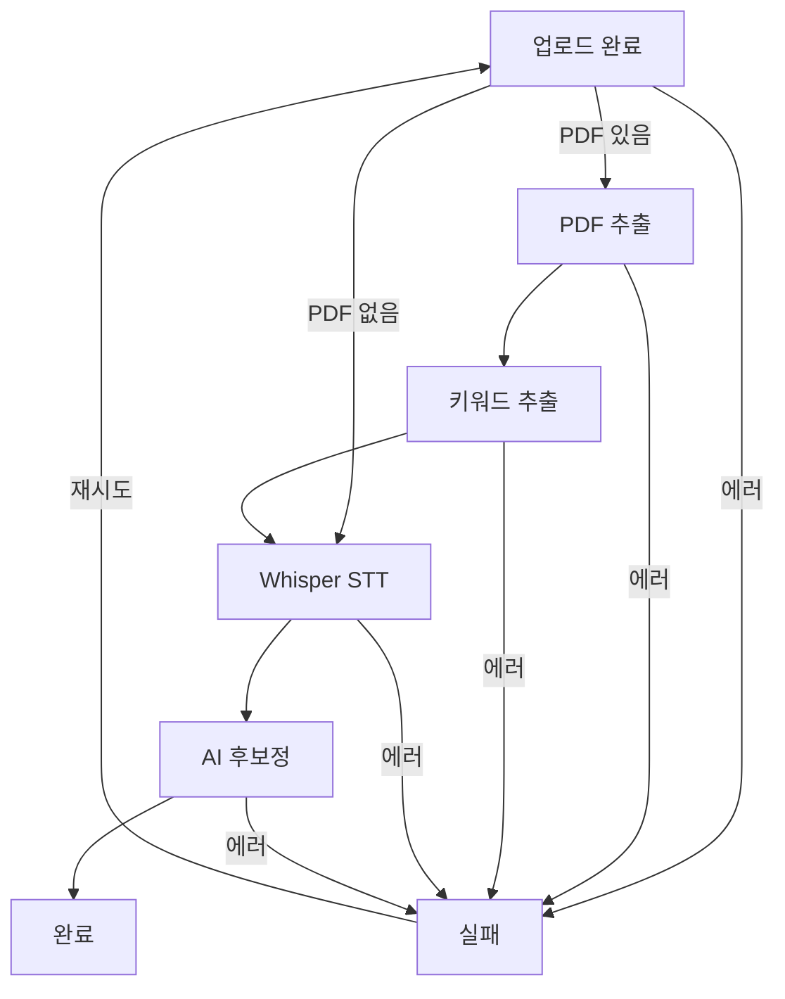

# 파이프라인 상태 전이 플로우 (MVP)



- 각 단계별 실패 시 `processing_jobs.stage=failed`, `boards.status=failed`로 전환
- 재시도 시 실패 단계부터 resume

---

# 주요 마이그레이션/테스트/실행법

## Alembic 마이그레이션 적용

```bash
cd backend
bash scripts/migrate.sh upgrade
```

## Alembic 롤백

```bash
cd backend
bash scripts/migrate.sh downgrade
```

## 전체 테스트 실행

```bash
cd backend
python -m pytest
```

## 파이프라인 resume mock 테스트만 실행

```bash
cd backend
python -m pytest tests/test_pipeline_resume.py
```

---

# 개발환경 세팅
- Python 3.10 이상, poetry/venv 권장
- requirements.txt 기반 의존성 설치
- DB URL 등 환경변수는 .env 또는 settings.py로 관리

---

# 참고: 상세 API/모델/상태 정책은 docs/api-contract.md, domain-model.md, backend-api-design.md 참고
